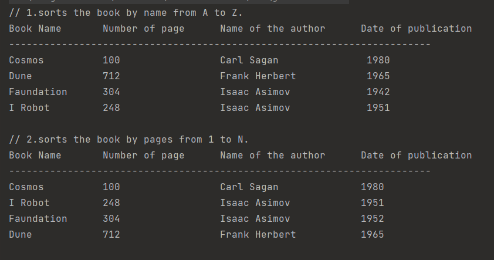

# Assignment - Book Sorter
## Book Sorter

1. Design a class called Book. 
2. Inherit from this class Comparable interface and override the "compareTo" method.
3. Inside this method, write the code that sorts the book by name from A to Z. 
4. Create 4 objects of this class and store the objects in a Set type structure. 
5. Then use a Set type data structure a second time and have it sort the books by page count.

- The Book class consists of the name of the book, the number of pages, the name of the author, and the date of publication.


>Thruput

## Installation

First, clone the project.

```bash
git clone https://github.com/mtamerb/assignment-booksorter.git
```


## Usage

After cloning the project, run in Intellij Idea, Eclipse Idea etc. programs.

## Contributing

Pull requests are accepted. For major changes, please open a thread to discuss what you want to change first.


## License
[MIT](https://choosealicense.com/licenses/mit/)
